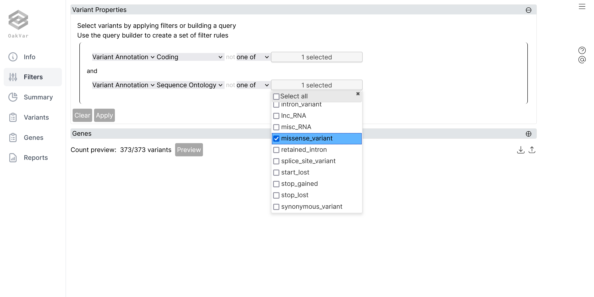

#### Installation and setup

Install OakVar and setup following [this instruction](install_system.md).

#### Check system configuration

How OakVar has been set up can be viewed with `ov config system` command.

    ov config system

    publish_url: https://store.oakvar.com
    store_url: https://store.oakvar.com
    ...
    default_assembly: hg38
    sys_conf_path: /Users/Shared/oakvar/conf/system.yml
    root_dir: /Users/Shared/oakvar
    modules_dir: /Users/Shared/oakvar/modules
    conf_dir: /Users/Shared/oakvar/conf
    jobs_dir: /Users/Shared/oakvar/jobs
    log_dir: /Users/Shared/oakvar/logs

`modules_dir` is where OakVar modules for conversion, mapping, annotation, and reporting as well as OakVar applications are stored.

#### Install ClinVar annotation module

In this tutorial, we will annotate variants with [ClinVar](https://www.ncbi.nlm.nih.gov/clinvar). To do so, we install the ClinVar module.

    ov module install clinvar

#### Uninstall a module

Just to practice uninstalling a module, we'll install and then uninstall [BioGRID](http://thebiogrid.org).

    ov module install biogrid
    ov module uninstall biogrid

#### Create an example input

Next, we need some variants to annotate. OakVar has a built-in variant file for this purpose.

    ov new exampleinput

This will create an example input file, `exampleinput`, in the current directory.

#### Run an annotation job

Now, we annotate the example input file with ClinVar and then create a result VCF file with annotated variants. `-a` option controls annotation sources and `-t` option report formats.

    ov run exampleinput -a clinvar -t vcf

This will create `exampleinuput.vcf` which will have the input variants annotated with ClinVar. Additionally, `exampleinput.sqlite` will be created. This file is a SQLite database file with annotated variants.

#### Examine the annotated variants

Let's examine the annotated variants in the previous step. `ov report` is used to show or generate the output of annotated variants.

    ov report exampleinput.sqlite -t stdout

This will print out the annotated variants to the screen. `-t stdout` tells `ov report` to use `stdoutreporter` module, which is a reporter module and will receive annotated variants, variant by variant, from `ov report` and convert it to the standard output of the terminal.

#### Generate an Excel report of annotated variants

There are more reporter modules. `excelreporter`, an Excel format reporting module is included in OakVar by default. `-s` option defines the file name of the report file except the extension.

    ov report exampleinput.sqlite -t excel -s annotated

This will generate `annotated.xlsx` file with annotated variants.

#### Visualize annotated variants

OakVar comes with a couple of embedded web applications, for graphical user interface-based operation of OakVar. Let's explore the annotated variants on a web browser.

    ov gui exampleinput.sqlite

This will launch an interactive result viewer for the analysis job done in the previous section.

Click the sidebar and look around the tables with annotated variants and the widgets in each option. *Filter* option on the sidebar has a customizable filter section.

Click the brown `+` button at the left corner to add and set up filter criteria, and click `Apply` button to load filtered variants.

`ov gui` will launch a graphical user interface for managing analysis jobs and modules. 

Click `Manually enter variant instead` button followed by `Try an example` to use an example input and click `Annotate` button to run an annotation job. Optional reporters such as `VCF Reporter`,`Text Reporter` and `Excel Reporter` can be run by selecting the respective option on the right side. Additionally, modules can be selected below. The new job will show on the results option. 

As seen below, `ClinVar` and `Gene Ontonogy` modules are available to run on the example job. 

Installing and uninstalling modules can be managed on `Store` tab.

